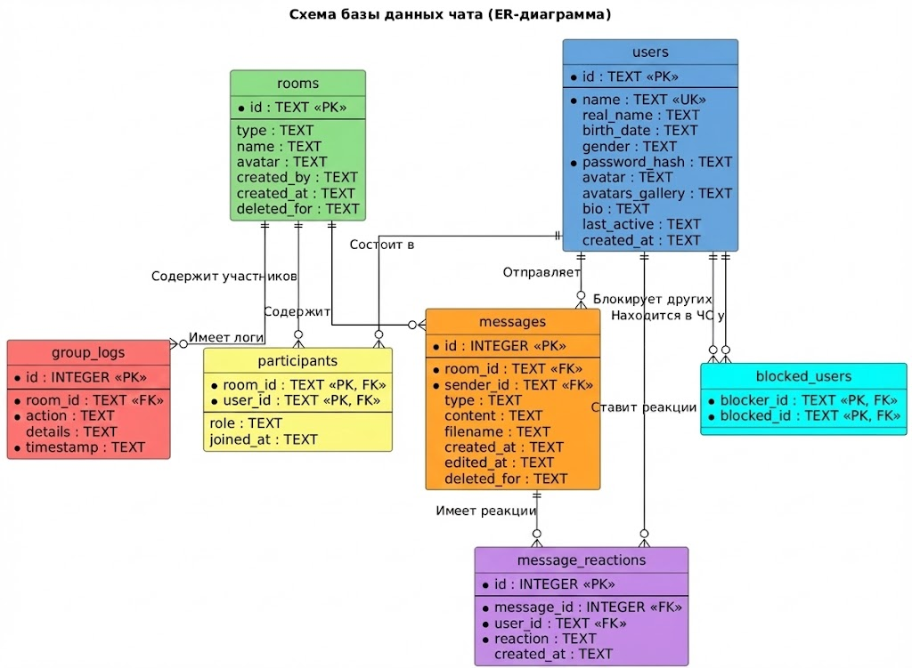

# Corporate Chats (Корпоративный Мессенджер)

Это веб-приложение для корпоративного общения с поддержкой обмена сообщениями в реальном времени, видеозвонков, групповых чатов и управления ролями. Серверная часть написана на **Python (Flask)** с использованием **Socket.IO** для мгновенного взаимодействия.

## 🛠 Технологический стек

* **Язык:** Python 3.x
* **Web Framework:** Flask 3.0.0
* **Real-time Communication:** Flask-SocketIO (WebSocket)
* **Database:** SQLite (встроенная, легковесная)
* **Authentication:** Flask-JWT-Extended (JSON Web Tokens)
* **Frontend (Static):** HTML/CSS/JS (взаимодействие через SocketIO и REST API)

## 🌟 Основной функционал

### 👤 Пользователи и Профиль

* **Авторизация:** Регистрация и вход с использованием JWT токенов.
* **Профиль:** Редактирование реального имени, биографии, даты рождения (с автоматическим расчетом возраста) и пола.
* **Аватары:**
* Загрузка изображений.
* Поддержка **галереи аватаров** (история загруженных фото).
* Выбор активного аватара из ранее загруженных.


* **Статус:** Отслеживание статуса «Онлайн» и времени последней активности (`last_active`).
* **Приватность:** Возможность блокировки (`block/unblock`) нежелательных пользователей.

### 💬 Чаты и Сообщения

* **Типы чатов:** Личные (1-на-1) и Групповые.
* **Общий чат:** Автоматическое добавление всех пользователей в комнату `general`.
* **Сообщения:**
* Текстовые сообщения.
* Обмен файлами (хранение в base64).
* Поддержка голосовых и видео-сообщений (типы `voice`, `video`).
* Редактирование сообщений.
* Удаление сообщений (локально «для себя» или глобально «для всех»).


* **Реакции:** Возможность ставить и убирать реакции (эмодзи) на сообщения.

### 👥 Управление Группами

* **Ролевая модель:** В каждой группе есть роли: `owner` (владелец), `admin` (администратор), `member` (участник).
* **Администрирование:**
* Назначение и разжалование администраторов.
* Удаление и добавление участников.
* Изменение названия и аватара группы.


* **Логирование (Audit Logs):** Система записывает все важные действия в группе (кто кого добавил, изменил название и т.д.) в таблицу `group_logs`.

### 📹 Видеосвязь

* Сигнальный механизм для WebRTC (события `join_video_room`, `user_connected_video`) для организации P2P видеозвонков.

---

## 🗄 Структура Базы Данных (SQLite)

Приложение использует реляционную структуру данных. Файл базы: `chat.db`.

### Сущности (Таблицы)

#### 1. `users` (Пользователи)

Хранит учетные данные и профиль.

* `id`: Уникальный идентификатор (хеш).
* `name`: Логин (уникальный).
* `real_name`: Настоящее имя.
* `password_hash`: Хеш пароля.
* `avatars_gallery`: JSON-список ссылок/данных прошлых аватаров.
* `last_active`: Временная метка последней активности.
* *Прочее:* `birth_date`, `gender`, `bio`, `created_at`.

#### 2. `rooms` (Комнаты чатов)

Хранит информацию о беседе.

* `id`: Уникальный ID комнаты.
* `type`: Тип чата (`private` или `group`).
* `deleted_for`: JSON-список пользователей, удаливших чат у себя.
* *Прочее:* `name`, `avatar`, `created_by`.

#### 3. `participants` (Участники)

Связующая таблица «Многие-ко-многим» между пользователями и комнатами.

* `room_id`: Ссылка на комнату.
* `user_id`: Ссылка на пользователя.
* `role`: Роль участника (`owner`, `admin`, `member`).

#### 4. `messages` (Сообщения)

* `room_id`: Куда отправлено.
* `sender_id`: Кем отправлено.
* `type`: Тип контента (`text`, `file`, `voice`, `video`, `system`).
* `content`: Текст сообщения или закодированный файл.
* `deleted_for`: Кто скрыл это сообщение.
* *Временные метки:* `created_at`, `edited_at`.

#### 5. `message_reactions` (Реакции)

* `message_id`: На какое сообщение.
* `user_id`: Кто поставил.
* `reaction`: Текст реакции (эмодзи).

#### 6. `group_logs` (Журнал действий группы)

История административных действий.

* `room_id`: В какой группе.
* `action`: Тип действия (`create`, `update`, `add`, `remove`, `promote`, `demote`).
* `details`: Текстовое описание события.

#### 7. `blocked_users` (Черный список)

* `blocker_id`: Кто заблокировал.
* `blocked_id`: Кого заблокировали.

---

## 🚀 Установка и Запуск

1. **Клонируйте репозиторий:**
```bash
git clone https://github.com/AlexMaster168/corporate-chats
cd corporate-chats

```

2. **Создайте виртуальное окружение (рекомендуется):**
```bash
python -m venv venv
# Windows
venv\Scripts\activate
# Linux/Mac
source venv/bin/activate

```


3. **Установите зависимости:**
```bash
pip install -r requirements.txt

```


4. **Запустите приложение:**
```bash
python run.py

```


*При первом запуске база данных `chat.db` инициализируется автоматически.*

## 📡 API Endpoints & Socket Events

### REST API (`/api/...`)

* `POST /auth/register` — Регистрация.
* `POST /auth/login` — Вход.
* `POST /user/profile` — Обновление био/имени.
* `POST /user/avatar/upload` — Загрузка нового аватара.
* `POST /upload` — Загрузка файла в чат.
* `POST /group/logs` — Получение логов группы (только для админов).

### Основные SocketIO события

* `connect/disconnect` — Управление статусом онлайн.
* `send_message` — Отправка сообщения.
* `new_message` — Получение нового сообщения (broadcast в комнату).
* `edit_message` / `delete_message` — Управление контентом.
* `add_reaction` / `remove_reaction` — Реакции.
* `create_group` / `update_group_settings` — Управление группами.
* `join_video_room` — Подключение к видеозвонку.